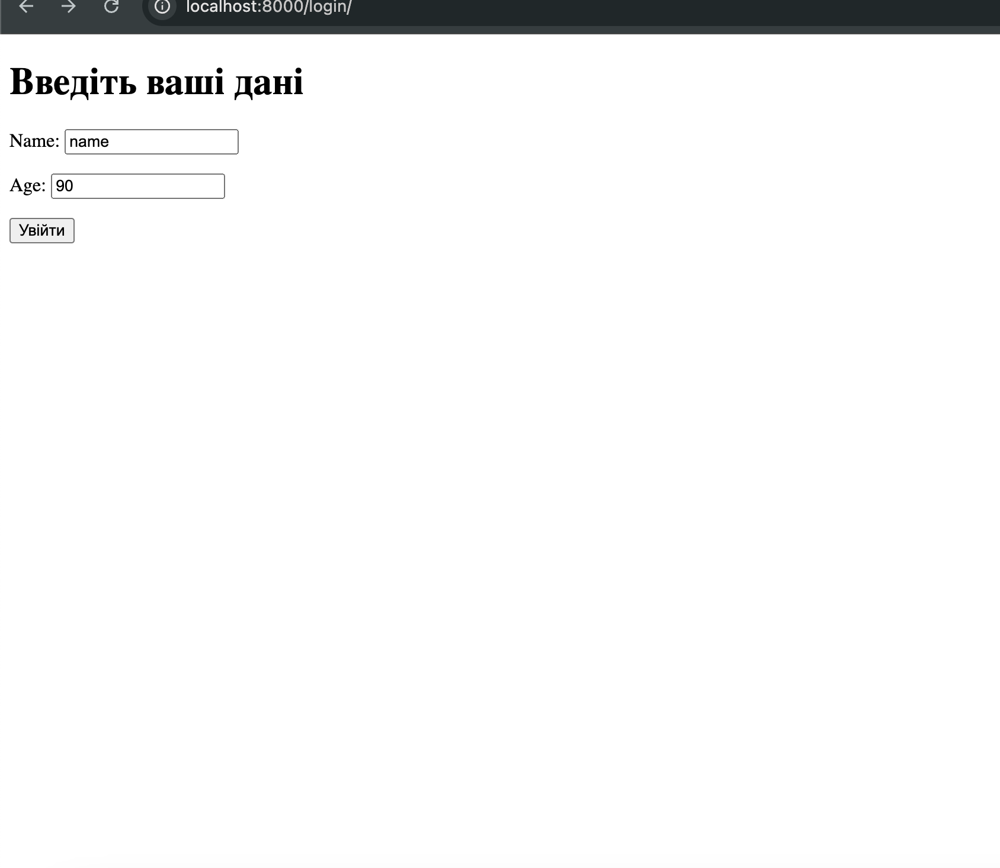
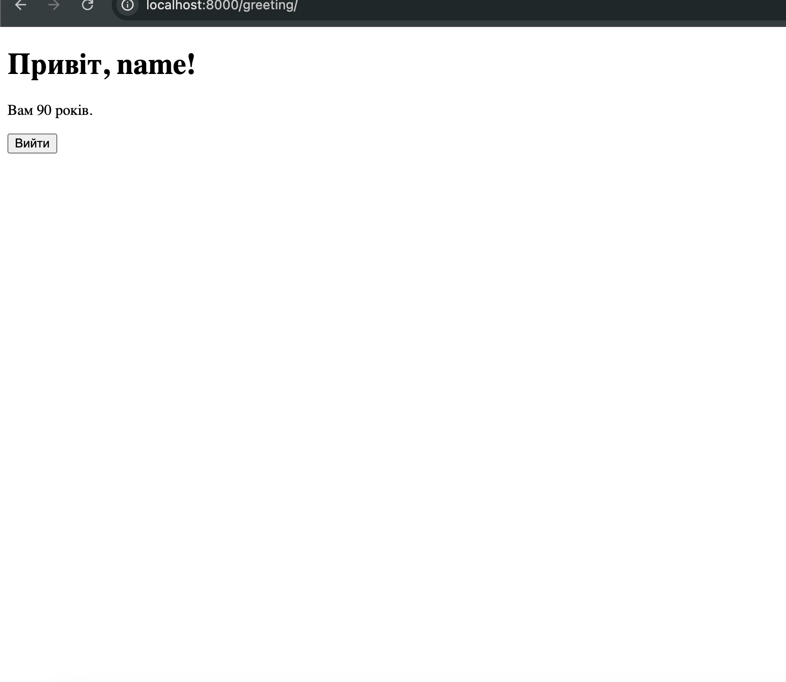
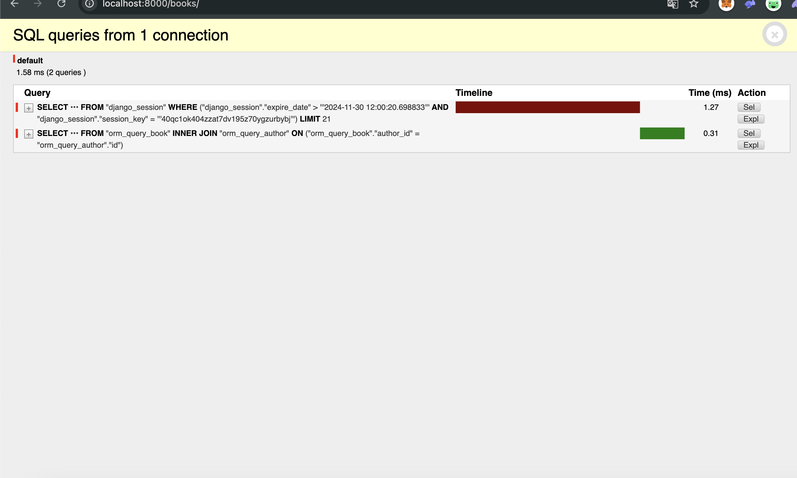
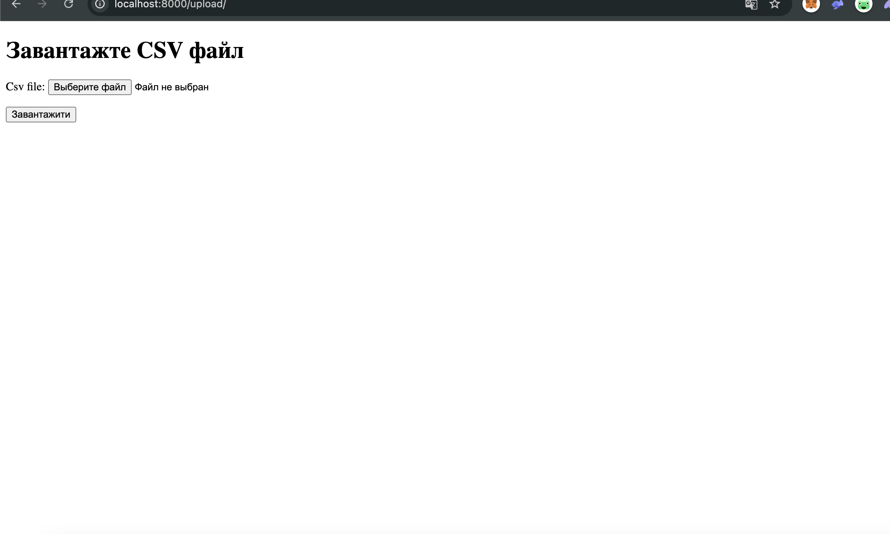
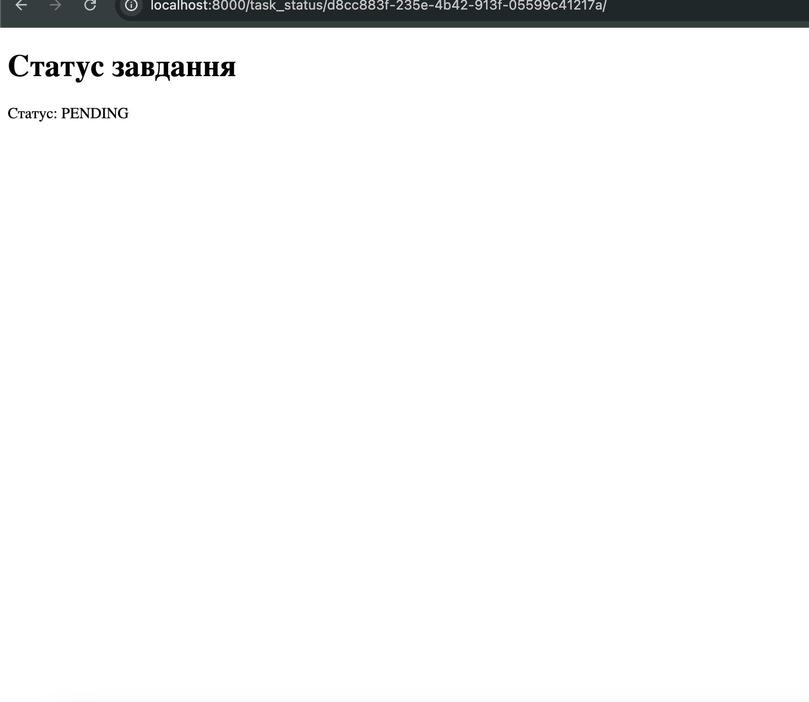
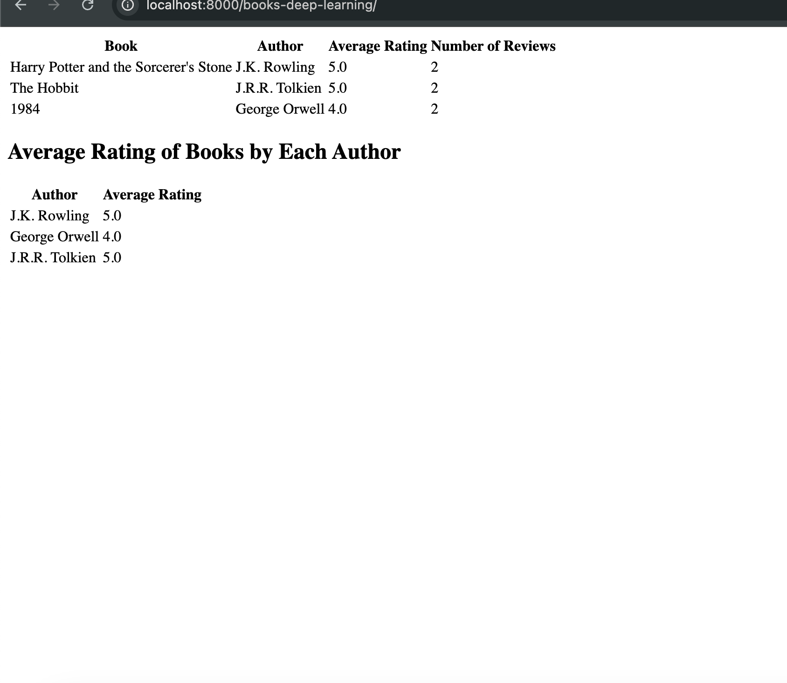
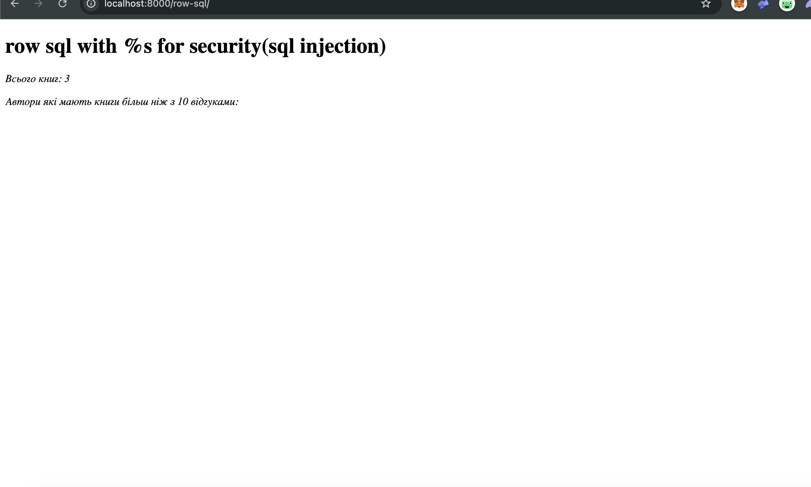

# Django ORM & Performance Optimization Project

Цей проект має на меті покращити знання роботи з Django, оптимізацією запитів у ORM, роботою з кешуванням, сесіями, використанням асинхронних завдань через Celery та багато іншого. Проект містить кілька основних задач для досягнення високої продуктивності та ефективного використання технологій.

## Завдання:

### 1. Управління сесіями та cookies
- Створення Django-застосунку з формою входу, де:
  - Користувач вводить ім'я та вік.
  - Ім'я зберігається у cookies, а вік — у сесії.
- Створення сторінки привітання, яка:
  - Використовує дані з cookies та сесії для персоналізації вітання (наприклад, "Привіт, {ім'я}, вам {вік} років").
  - Дозволяє видаляти сесійні дані та cookies.
- Реалізація перевірки та автоподовження cookies.

### 2. Оптимізація та продуктивність

#### 2.1. Оптимізація запитів у ORM
- Створення моделей `Author`, `Book`, та `Review` з відповідними зв'язками (один Author може мати багато книг, а Book може мати кілька відгуків).
- Заповнення бази даних тестовими даними (щонайменше 50 записів).
- Написання запитів:
  - Без оптимізації.
  - З використанням `select_related` та `prefetch_related`.
- Вимірювання часу виконання запитів та порівняння продуктивності.

#### 2.2. Кешування
- Реалізація відображення списку книг з авторами.
- Кешування результатів за допомогою вбудованих механізмів Django (cache).
- Налаштування кешування за допомогою Memcached або Redis.
- Написання middleware для кешування сторінки списку книг для анонімних користувачів.

#### 2.3. Аналіз продуктивності з `django-debug-toolbar`
- Встановлення та налаштування `django-debug-toolbar` для аналізу продуктивності запитів.
- Виявлення вузьких місць, таких як надмірні SQL-запити, та оптимізація.

#### 2.4. Оптимізація шаблонів
- Використання шаблонів для відображення списку книг з авторами та відгуками.
- Оптимізація передачі даних до шаблону (наприклад, оптимізовані запити).
- Перевірка продуктивності шаблонів за допомогою `django-debug-toolbar`.

#### 2.5. Асинхронні завдання з Celery
- Встановлення та налаштування Celery з брокером повідомлень Redis.
- Написання асинхронного завдання:
  - Імпортує дані про книги з файлу CSV.
  - Зберігає дані в базі.
  - Відправляє користувачеві email з підтвердженням завершення завдання.
- Реалізація відображення стану завдання на окремій сторінці за допомогою Celery.

### 3. Глибоке занурення в ORM

#### 3.1. Робота з анотаціями та агрегаціями
- Підрахунок середнього рейтингу книг кожного автора.
- Підрахунок кількості відгуків кожної книги.
- Сортування книг за кількістю відгуків та середньою оцінкою.
- Реалізація сторінки, що відображає ці дані в таблиці.

#### 3.2. Використання Raw SQL
- Написання відображення для виконання "сирого" SQL-запиту:
  - Вибір всіх авторів, які мають книги з більш ніж 10 відгуками.
  - Підрахунок загальної кількості книг.
- Реалізація захисту від SQL-ін'єкцій під час передачі параметрів у "сирий" SQL.

#### 3.3. Індексація та оптимізація запитів
- Налаштування індексів для моделей `Book` та `Review` (наприклад, індексація поля `rating`).
- Виконання вимірювання часу виконання запитів до та після додавання індексів.

#### 3.4. Нестандартні бази даних (NoSQL)
- Налаштування Django для роботи з MongoDB або Firebase.
- Реалізація збереження та читання даних з NoSQL бази даних.
- Порівняння продуктивності з реляційною базою даних.

## Інструкція для запуску:

Клонуйте проєкт, завантажте віртуальне оточення, активуйте, завантажте залежності. 
Створіть .env файл для того щоб прописати настройки до вашої пошти, в settings.py пропишіть настройки для вашої mongodb

## Булм виконані наступні дії:
1. Управління сесіями та cookies

	•	Реалізовано форму входу, де користувач вводить ім’я та вік.
	•	Ім’я зберігається у cookies, вік – у сесії.
	•	Створено сторінку привітання з персоналізованим повідомленням: “Привіт, {ім’я}, вам {вік} років”.
	•	Додано функціонал видалення cookies та сесії через кнопку “Вийти”.
	•	Впроваджено автоподовження cookies під час активного використання програми.
	•	Використано django.contrib.sessions для зберігання даних у базі.

2. Оптимізація та продуктивність

2.1. Оптимізація запитів у ORM
	•	Створено моделі Author, Book, Review із відповідними зв’язками.
	•	Заповнено базу даних 50+ тестовими записами.
	•	Проведено тестування запитів без оптимізації та з використанням select_related/prefetch_related.
	•	Зафіксовано значне зменшення часу виконання запитів так як моделі зв'язані друг з другом і використовується зовнішній ключ та Join

2.2. Кешування
	•	Реалізовано кешування списку книг із авторами за допомогою Django Cache Framework.
	•	Налаштовано оновлення кешу при додаванні/зміні книги.
	•	Використано Memcached для кешування.
	•	Написано middleware для кешування сторінки книг для анонімних користувачів.

2.3. Аналіз продуктивності
	•	Встановлено django-debug-toolbar.
	•	Виявлено та виправлено вузькі місця в SQL-запитах, оптимізовано запити(для додатку orm-query).

2.4. Оптимізація шаблонів
	•	Використано шаблони для списку книг з авторами та відгуками.
	•	Оптимізовано передачу даних у шаблони.
	•	Перевірено продуктивність шаблонів за допомогою django-debug-toolbar.

2.5. Асинхронні завдання з Celery
	•	Налаштовано Celery з Redis як брокером повідомлень.
	•	Реалізовано імпорт книг із CSV, збереження в базу, відправку email після завершення завдання.
	•	Створено сторінку відображення стану завдання.

3. Глибоке занурення в ORM

3.1. Анотації та агрегації
	•	Підраховано середній рейтинг книг авторів та кількість відгуків кожної книги.
	•	Реалізовано сортування книг за кількістю відгуків та середньою оцінкою.
	•	Створено таблицю з результатами.

3.2. Використання Raw SQL
	•	Написано запити для вибору авторів із книгами (10+ відгуків) та підрахунку загальної кількості книг.
	•	Реалізовано захист від SQL-ін’єкцій, за допомогою параметризації(плейсхолдер %s).

3.3. Індексація та оптимізація
	•	Додано індекси для полів моделей Book та Review.
	•	іНдекси прешвидшують процес пошуку.

3.4. Нестандартні бази даних (NoSQL)
	•	Налаштовано MongoDB для Django.
	•	Реалізовано збереження та читання даних у MongoDB.
	•	В данному дз, краще буде sql, т.я. потрібна строгоструктурованість і цілісність данних

## Скріни виконаних завдань:

  
